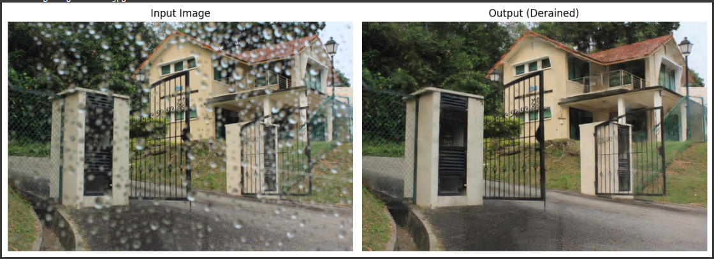

## RainDropRemovalUsingGANbasedArchitecture
Rain drop removal from a single image using a novel GAN based architecture

### Abstract

Raindrops adhered to a glass window or camera lens can severely hamper the visibility of a background scene and degrade an image considerably. In this paper, we first considered a baseline model that employed, RaindropRemovalNet, which utilizes FFT-based residual blocks to improve frequency-domain features and Global Context (GC) blocks to learn long-range spatial relations. Although efficient, this architecture comes with high computation expenses because it performs frequency-space processing. We mitigate this through a more superior GAN-based model that maximizes performance while enhancing efficiency. Our architecture employs a Generator-Discriminator combination that is trained with a hybrid loss function merging L1 loss, perceptual loss through the use of a pre-trained VGG network, and adversarial loss. This methodology allows the Generator to generate visually consistent, raindrop-free images that are close to the ground truth. Paired rainy-clean image datasets experiments prove that our GAN-based approach can achieve better qualitative performance with better PSNR and SSIM scores by eliminating both coarse and fine raindrops with detailed background restoration. This research reveals the possibilities of the frequency-domain processing, global attention mechanisms, and adversarial learning in reliable image restoration. 

## Qualitative analysis of input and output images at 25 training epoch and 50 training epoch 

## Prerequisites:

1. Python (version >= 3.0)
2. Google collabs (Preferrable) or Jupyter Notebook
3. NVIDIA GPU + CUDA CuDNN (CUDA 8.0)

## Demo

The demo pictures are put under the directory `./demo/input/` and `./demo/output/` is a sample of the output of the model. 

## Dataset

The whole dataset can be found here (or you can also refer the base paper for more information)

https://drive.google.com/open?id=1e7R76s6vwUJxILOcAsthgDLPSnOrQ49K

####Training Set:

861 image pairs for training.

####Testing Set A:

For quantitative evaluation where the alignment of image pairs is good. A subset of testing set B.

####Testing Set B:

239 image pairs for testing.

